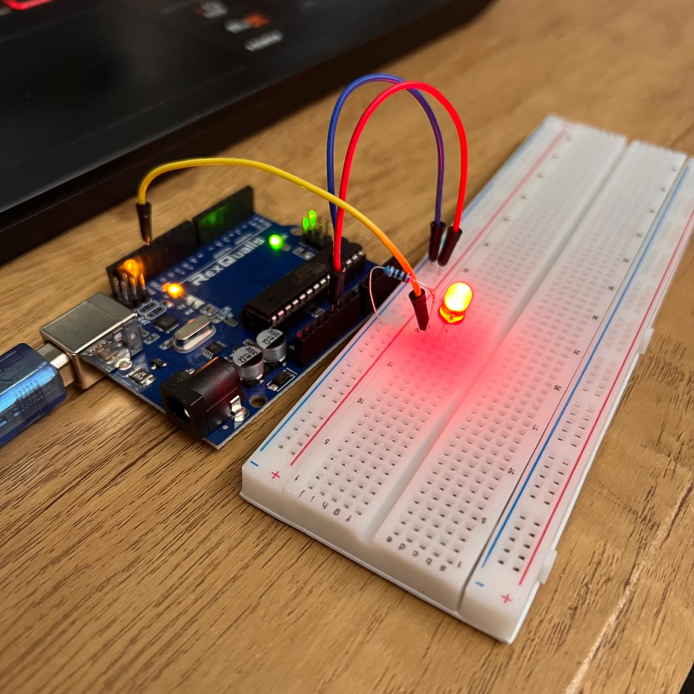

# Led-Parpadeante
## Juan Pablo Rosales - 2025
### Descripción
Proyecto simple de Arduino para encender y apagar un LED con Arduino  
  
  

### Objetivo
Aprender funcionamiento básico de Arduino y del LED
### Materiales
-Arduino Uno  
-LED  
-Resistencia 220Ω  
-Cables  
-Protoboard  

### Código
**Archivo Principal:** led_parpadeante.ino  
int led = 13;  // Pin digital a donde esta conenectado el led  
  
void setup() {  
  pinMode(led, OUTPUT);  // Configura el pin como salida  
}  
  
void loop() {  
  digitalWrite(led, HIGH); //Enciende el led  
  delay(1000);  //Agrega un delay de 1 segundo
  digitalWrite(led, LOW);  // Apaga el led  
  delay(1000);  //Agrega un delay de 1 segundo
}  

